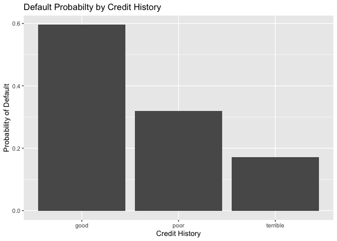
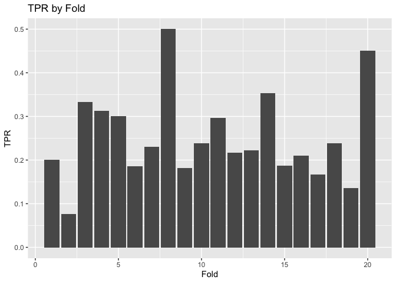

 

### Exercises 2

#### Abby Johnson

#### 3/7/22

 

### 1) Data visualization: UT CapMetro Ridership

 

From the figure above, we can see how UT CapMetro ridership changes by
hour, day of week, and month (Sep, Oct, Nov). We can see that the peak
boarding hour is about the same for all weekdays, but is much lower on
the weekends. This makes sense when we consider UT class times, and
students’demand (or lack-thereof) for a ride to campus on the weekends.
Additionally, average boardings on Mondays in September are lower, which
is likely due to the Monday university closure in observance of Labor
Day in September. Moreover, we can see the average boardings on
Wed/Thurs/Fri are lower in November for a similar reason. The university
closes Wed/Thurs/Fri of Thanksgiving week, so there is likely to be
almost no riders on the UT CapMetro routes for those days in November.

 

From the figure above, we can see how UT CapMetro ridership changes
across temperature, hour of the day, and weekdays/weekends. When we hold
hour of the day and weekend status constant, temperature does not seem
to have a noticeable effect on student ridership. Within each hour of
the day, we can see that ridership has a fairly flat correlation with
temperature, which suggests there is no relationship between temperature
and UT bus ridership.

 

### 2) Saratoga House Prices

 

In order to build the best predictive model of house prices in Saratoga,
NY, we can compare the performance of a linear model and a KNN model.
Using various characteristics that describe the house and property, each
model estimates what the price of an individual house should be. Then,
each model’s out-of-sample performance is cross-validated, in order to
account random variation in the data. With these cross-validated
out-of-sample performance measures, we can decide which model is better
at estimating house price.

**Cross-validated RMSE for best linear model:**

    ## [1] 58400.21

 

**Cross-validated RMSE for best KNN model:**

    ## [1] 70077.83

 

We can see that the linear model proves to be better at predicting house
price, because it has a significantly lower out-of-sample RMSE. The
difference between these two RMSE estimates is about 11,800. This means
that the linear model $11,800 closer in their predictions of the true
house price. This number is very large when you consider how much
potential tax revenue comes from $11,800. For example, if a local
property tax rate is 1.5%, $11,800 generates almost $200 of revenue.
Multiply that by just 2,000 homes in a county, and that becomes $400,000
of tax revenue that is potentially over or under-estimated. As a local
taxing authority, it is vital to mitigate this type of revenue
estimation error, therefore, the linear model proves to be the best
predictive choice.

 

### 3) Classification and retrospective sampling: German loan defaults

 

 From the figure above, we can see the
calculated probability of loan default for each type of credit history.
Those with ‘good’ credit history are far more likely to default on their
loan than those with ‘poor’ or ‘terrible’ credit history. Moreover,
those with ‘terrible’ credit history are the least likely to default on
their loan.

 

<table>
<caption>
**Logit Model Estimates For Predicting Default Probability**
</caption>
<thead>
<tr>
<th style="text-align:left;">
Predictor
</th>
<th style="text-align:right;">
Coefficient
</th>
<th style="text-align:right;">
SE
</th>
<th style="text-align:right;">
Z
</th>
<th style="text-align:right;">
p
</th>
</tr>
</thead>
<tbody>
<tr>
<td style="text-align:left;">
Intercept
</td>
<td style="text-align:right;">
-0.71
</td>
<td style="text-align:right;">
0.47
</td>
<td style="text-align:right;">
-1.50
</td>
<td style="text-align:right;">
0.134
</td>
</tr>
<tr>
<td style="text-align:left;">
Duration
</td>
<td style="text-align:right;">
0.03
</td>
<td style="text-align:right;">
0.01
</td>
<td style="text-align:right;">
3.12
</td>
<td style="text-align:right;">
0.002
</td>
</tr>
<tr>
<td style="text-align:left;">
Amount
</td>
<td style="text-align:right;">
0.00
</td>
<td style="text-align:right;">
0.00
</td>
<td style="text-align:right;">
2.63
</td>
<td style="text-align:right;">
0.009
</td>
</tr>
<tr>
<td style="text-align:left;">
Installment
</td>
<td style="text-align:right;">
0.22
</td>
<td style="text-align:right;">
0.08
</td>
<td style="text-align:right;">
2.91
</td>
<td style="text-align:right;">
0.004
</td>
</tr>
<tr>
<td style="text-align:left;">
Age
</td>
<td style="text-align:right;">
-0.02
</td>
<td style="text-align:right;">
0.01
</td>
<td style="text-align:right;">
-2.79
</td>
<td style="text-align:right;">
0.005
</td>
</tr>
<tr>
<td style="text-align:left;">
Poor History
</td>
<td style="text-align:right;">
-1.11
</td>
<td style="text-align:right;">
0.25
</td>
<td style="text-align:right;">
-4.48
</td>
<td style="text-align:right;">
0.000
</td>
</tr>
<tr>
<td style="text-align:left;">
Terrible History
</td>
<td style="text-align:right;">
-1.88
</td>
<td style="text-align:right;">
0.28
</td>
<td style="text-align:right;">
-6.68
</td>
<td style="text-align:right;">
0.000
</td>
</tr>
<tr>
<td style="text-align:left;">
Education
</td>
<td style="text-align:right;">
0.72
</td>
<td style="text-align:right;">
0.37
</td>
<td style="text-align:right;">
1.95
</td>
<td style="text-align:right;">
0.051
</td>
</tr>
<tr>
<td style="text-align:left;">
Goods/Repair
</td>
<td style="text-align:right;">
0.10
</td>
<td style="text-align:right;">
0.26
</td>
<td style="text-align:right;">
0.41
</td>
<td style="text-align:right;">
0.683
</td>
</tr>
<tr>
<td style="text-align:left;">
New Car
</td>
<td style="text-align:right;">
0.85
</td>
<td style="text-align:right;">
0.28
</td>
<td style="text-align:right;">
3.08
</td>
<td style="text-align:right;">
0.002
</td>
</tr>
<tr>
<td style="text-align:left;">
Used Car
</td>
<td style="text-align:right;">
-0.80
</td>
<td style="text-align:right;">
0.36
</td>
<td style="text-align:right;">
-2.21
</td>
<td style="text-align:right;">
0.027
</td>
</tr>
<tr>
<td style="text-align:left;">
German
</td>
<td style="text-align:right;">
-1.26
</td>
<td style="text-align:right;">
0.58
</td>
<td style="text-align:right;">
-2.19
</td>
<td style="text-align:right;">
0.028
</td>
</tr>
</tbody>
</table>

From the logit regression estimates above, we can see how credit history
is estimated to effect the probability of loan default. Similar to the
first bar plot, the logit coefficients tell us that individuals with
‘poor’ history are less likely to default than those with ‘good’
history, and those with ‘terrible’ history are the least likely to
default of all credit history groups.

 

Based on the results of this data, I do not think this data set is
appropriate for building a predictive model of defaults. Individuals
with ‘good’ credit histories should be the least likely to default on
their loans, while those with ‘terrible’ history should be the most
likely to default on their loans. Individuals with ‘good’ credit are
more likely to be offered a loan in the first place, which means there
inevitably were more loans with ‘good’ credit history in the
retrospective data collection. This means that ‘good’ credit loans will
have artificially high default rates, and ‘terrible’ credit loans will
have artificially low default rates. Additionally, there was no
randomization in the default status of the retrospective data
collection, which eliminates any natural variation.

 

In an effort to improve the bank’s sampling scheme, I would recommend
taking a large random sample of loans from the bank’s overall portfolio
and bootstrapping the sample in order to get more accurate estimates of
loan default probability. Therefore, the bank won’t over-sample defaults
with ‘good’ history and maintain random variation.

 

### 4) Model building and validation: Children and hotel reservations

 

**Compare Out-of-Sample Performance**

 

*Best Linear Model* 

 

Using deviance as a measure of out-of-sample performance, the best
linear model achieves a binomial deviance lower than the baseline 1
model, and marginally lower than the baseline 2 model.

 

#### Model Validation: Step 1

 

Using the best linear model and the validation data set, I calculated
the True Positive Rate (Sensitivity) and the False Positive Rate
(Specificity) for the predictions of the children variable. With these
two measurements, I created a ROC curve as seen below.

 

 

#### Model Validation: Step 2

 

After creating 20 folds in the validation data set, I predicted whether
each booking would have children on it, and then estimated the total
expected number of bookings with children for each fold. Then, I
compared these predictions with the actual number of bookings with
children for each fold, and calculated the True Positive Rate (TRP).

 

The mean TPR across all folds was about 25%. This means that among the
bookings with children on it, the model correctly predicted 25% as
having children. The plot below summarizes the TRP for all 20 folds. We
can see that the TRP ranges from a little less than 10% up to about 50%.

    ##     meanTPR
    ## 1 0.2518314

 
