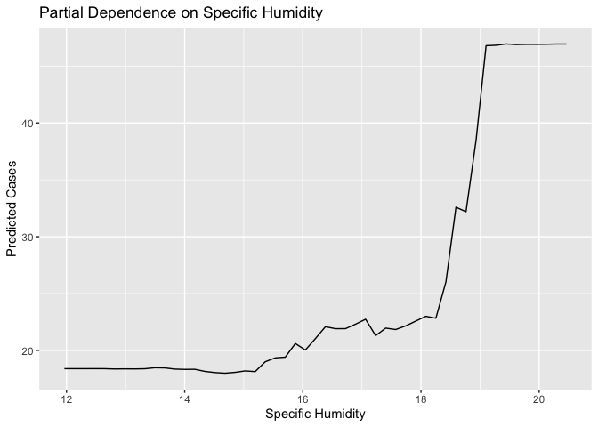
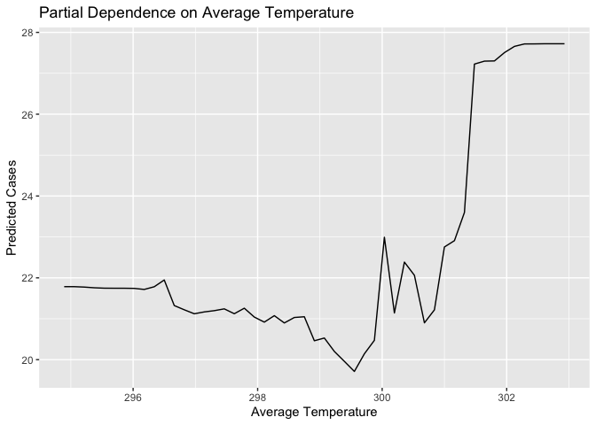
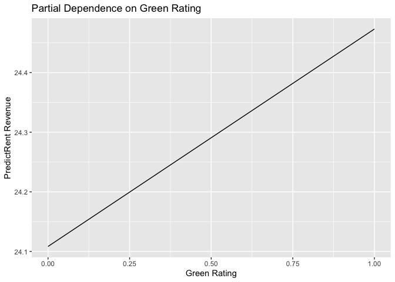
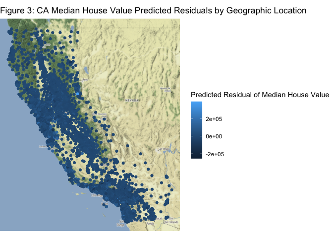

 

### Exercises 3

#### Abby Johnson

#### 4/6/22

 

### 1) What Causes What?

 

(**Based on [this podcast from Planet
Money.](https://www.npr.org/sections/money/2013/04/23/178635250/episode-453-what-causes-what)**)

 

**1. Why can’t I just get data from a few different cities and run the
regression of “Crime” on “Police” to understand how more cops in the
streets affect crime?\* (“Crime” refers to some measure of crime rate
and “Police” measures the number of cops in a city.)**

correlation, covariance/variance, independence

We can’t run a simple regression of “Crime” on “Police” to understand
how more cops in the street affect crime, because crime is highly
correlated with the number of police. For example, in areas with
consistently high crime rates, there will be an influx of police
present. However, we may still see crime increase in this area. The
crime rate often predicts the number of cops, so we cannot separate the
effect that police has on crime.

**2. How were the researchers from UPenn able to isolate this effect?
Briefly describe their approach and discuss their result in the “Table
2” below, from the researchers’ paper.**

The researchers at UPenn were able to isolate this effect using an
indicator of terrorist threat in a city. When a city is under a “high
alert” of terrorist threat, the number of cops in the streets increases.
This increase in police force is completely uncorrelated with street
crime, therefore it makes a good instrument for police force in the
model. With the high alert variable, we can see the relationship between
crime and the number of cops on the street, regardless of the street
crime already present.

As shown in “Table 2” below, the high alert variable has a significant
negative relationship with crime, both by itself and controlling for
Metro ridership. Therefore, we can see that an increase of cops on the
street does in fact correlate to lower levels of crime.

**3. Why did they have to control for Metro ridership? What was that
trying to capture?**

omitted variable bias

The researchers had to control for Metro ridership, because they wanted
to make sure that the number of potential victims of street crime
remained constant despite a terrorist alert. The researchers considered
that a high alert of terrorist threat may reduce the number of people on
the street, and therefore reduce the amount of crime. Comparing Metro
ridership across all levels of terrorist alerts helps the researchers
understand if civilian presence is the true cause of a decrease in
crime.

**From “Table 4” below, describe the model being estimated in the first
column? What is the conclusion?**

The model in the first coloumn of “Table 4” below, estimates if an
increase in cops affects crime differently in District 1 compared to all
of the other districts when controlling for Metro ridership. From the
table results, we can see that there does seem to be a significantly
different effect in District 1 compared to the other districts. District
1 has a significant negative estimate, while the other districts have a
statistically insignificant negative relationship.

 

### 2) Tree Modeling: Dengue Cases

 

In order to predict dengue cases in Puerto Rico and Peru, we compare a
CART, random forest, and gradient-boosted tree model, all of which using
city, season, specific humidity, average temperature, and amount of
precipitation as controls. Then, each model’s out-of-sample performance,
or RMSE, is compared to decide which model is best.

While we could use a log transformation for the total number of dengue
cases, tree models are fairly robust to skewed distributions of features
in the dataset. Moreover, maintaining total cases in the model, instead
of log cases, helps the model predictions and results be more intuitive
in their interpretation.

 

 

##### RMSE Comparison

    ## [1] 36.42166

    ## [1] 33.43344

    ## [1] 34.88553

 

From the RMSE estimates, we can see that the random forest model was
best at predicted dengue cases, because it has the lowest out-of-sample
performance. Now, let’s look at some partial dependence plots from our
random forest model.

 

##### Partial Dependence Plots

    ## Warning: Use of `object[[1L]]` is discouraged. Use `.data[[1L]]` instead.

    ## Warning: Use of `object[["yhat"]]` is discouraged. Use `.data[["yhat"]]`
    ## instead.

    ## Warning: Use of `object[[1L]]` is discouraged. Use `.data[[1L]]` instead.
    ## Use of `object[["yhat"]]` is discouraged. Use `.data[["yhat"]]` instead.

    ## Warning: Use of `object[[1L]]` is discouraged. Use `.data[[1L]]` instead.
    ## Use of `object[["yhat"]]` is discouraged. Use `.data[["yhat"]]` instead.

 

From these partial dependence plots, we can see that as humidity
increases and passes a certain threshold, dengue cases rapidly increase.
Likewise, as precipitation and temperature increase, the number of
dengue cases rapidly increases.

 

### 3) Predictive Model Building: Green Certification

 

#### Overview

As energy efficient and “green” construction increases in popularity, it
is important to understand how this type of construction affects
revenues for property owners. In an effort to analyze this relationship,
we should build a model to predict how green status affects revenue per
square foot per calendar year, controlling for other building
characteristics.

#### Data & Model

I use data containing information on 7,894 commercial rental properties
from across the United States, 685 of which have been awarded either
LEED or EnergyStar certification as a green building. The dataset also
includes various information such as size of building, leasing rate, and
amenities.

In order to predict revenue per square foot per calendar year, a new
variable needs to be created. Therefore, I created a new variable
“rent”, which is the product of the rent charged to tenants in the
building and the leasing rate.

I ran CART, random forest, and gradient-boosted tree models. I choose
tree models for this dataset, because they are robust to interactions
between features and this dataset is likely to include various
interactions between building characteristics. For example, energy costs
likely interact with size of building. So, tree models limit the need to
explicitly include interactions in the model.

Each model is a regression tree model of rent onto all variables in the
dataset other than “Rent (per tenant)”, “leasing\_rate”, “LEED”,
“Energystar”. Because these variables provide similar information to
other variables in the dataset (green rating and rent), I chose to drop
these variables from the model in order to limit over-fitting.

#### Results

 

##### Out-of-Sample Performance Comparison

    ## [1] 11.39701

    ## [1] 8.540294

    ## [1] 10.59909

##### Rand Forest Partial Dependence Plot

    ## Warning: Use of `object[[1L]]` is discouraged. Use `.data[[1L]]` instead.

    ## Warning: Use of `object[["yhat"]]` is discouraged. Use `.data[["yhat"]]`
    ## instead.

#### Conclusion

Based on the results of the models, the random forest model performed
the best with the lowest RMSE. Looking at the partial dependence plot of
rent revenue on green rating, we can see that the average change in
rental income per square foot increases by about 0.5 for building with a
green rating. These results provide evidence that green rated buildings
have a higher total revenue from rent.

 

### 4) Predictive Model Building: California Housing

 

#### Overview

Location is an important factor when considering house value. For
example, geographic proximity to certain amenities or natural features
can dramatically increase the value of a home. Such is the case for
homes in California. In an effort to analyze this relationship for
California homes, I built a model to predict how location and other
housing characteristics affect median house value.

#### Data & Model

I use data containing information at the census-tract level on
residential housing in the state of California. The dataset include
information on house longitude, latitude, median age, total rooms, total
bedrooms, population, households, and median income.

I ran CART, random forest, and gradient-boosted tree models. I choose
tree models for this dataset, because they are robust to interactions
between features, and this dataset is likely to include various
interactions between housing characteristics. For example, total rooms
likely interact with total bedrooms. So, tree models limit the need to
explicitly include interactions in the model.

Each model is a regression tree model of median house value onto
everything in the dataset except “longitude”, “latitude”, “households”,
and “population”. These excluded variables are objective information
about the census tract, and likely don’t have much relationship with
house value. Therefore, I excluded these variables to limit unnecessary
noise or variation in the models.

We can plot the observationsf median house value on a map according to
their respective longitude and latitude, to visualize how geographic
location may affect house value. Then, we can plot the predictions from
the best model on a map to visualize out predictions in comparison to
the true values. Likewise, we can plot the residuals of our predictions
to visualize how accurate our predictions are.

#### Results

##### Out-of-Sample Performance Comparison

    ## [1] 77193.98

    ## [1] 74083.96

    ## [1] 71666.27

##### Median House Values, Predictions, and Residuals by Geographic Location

**Figure 1** 

**Figure 2** 

**Figure 3** 

 

#### Conclusion

From the model results, we can see that the gradient-boosted tree model
performed the best with the lowest RMSE. From this model, we can use the
geographic plots to visualize the predicted median house values
(Figure2) in comparison to the true median house values (Figure 1). From
these figures, we can see that the distribution of the predicted values
are very close to the true values. Moreover, Figure 3 shows the
distribution of the predicted residuals, which clearly show low residual
estimates on average.

 
