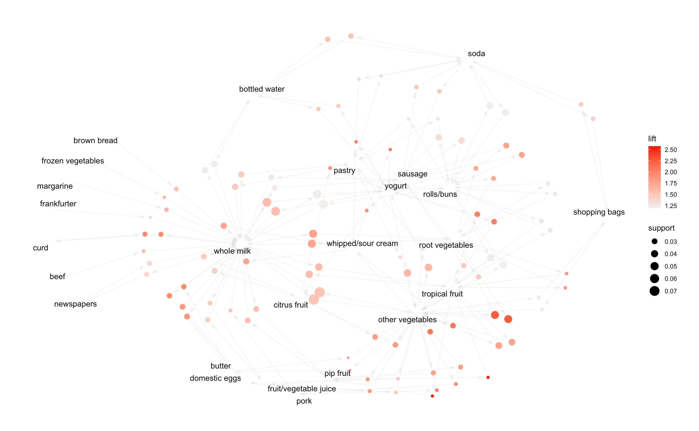

```{r setup, include=FALSE}
knitr::opts_chunk$set(fig.path = 'figures/')

# installs the librarian package if you don't have it
if (!("librarian" %in% rownames(utils::installed.packages()))) {
  utils::install.packages("librarian")
}

# put all of the packages that you import here
librarian::shelf( 
  cran_repo = "https://cran.microsoft.com/", # Dallas, TX
  ask = FALSE,
  stats, # https://stackoverflow.com/questions/26935095/r-dplyr-filter-not-masking-base-filter#answer-26935536
  here,
  kableExtra,
  rlang,
  ggthemes,
  tidyverse,
  janitor,
  magrittr,
  glue,
  lubridate,
  haven,
  snakecase,
  sandwich,
  lmtest,
  gganimate,
  gapminder,
  stargazer,
  snakecase,
  mosaicData,
  modelr,
  rsample,
  foreach,
  caret,
  parallel,
  purrr,
  pander,
  readr,
  xtable,
  gamlr,
  CVXR,
  pROC,
  ROCR,
  fastDummies, 
  randomForest, 
  gbm, 
  pdp,
  rpart,
  ggmap,
  devtools,
  usmap,
  splines,
  ggcorrplot,
  LICORS,
  arules,
  arulesViz,
  igraph,
  splitstackshape, 
  tidyr)

# tell here where we are so we can use it elsewhere
here::i_am("R/include.R")
```

<br>

### Exercises 4 
#### Abby Johnson
#### 5/2/22

<br>

### 1) Clustering & PCA

<br>

```{r p1, include=FALSE}
wine <- read_csv(here("data/wine.csv"), col_names = TRUE)
view(wine)
wine$red = ifelse(wine$color == "red", 1, 0)

#how does the wine quality compare across color of wine
quality_color = wine %>% 
  group_by(red) %>%
  summarize(avg_quality = mean(quality))

ggplot(quality_color) + 
  geom_col(aes(x=red, y=avg_quality))
#white wine has a marginally higher average wine quality 

#how many of each color of wine
ggplot(wine) +
  geom_bar(aes(x=red))
#almost 3x more white wine than red wine in the data 

#average response for each color, for each question,
wine_results = wine %>%
  group_by(red) %>% 
  select(-color) %>%
  summarize_all(mean) %>%
  column_to_rownames(var="red")
view(wine_results)
# now we have a tidy matrix of shows by questions

# a few quick plots
ggplot(rownames_to_column(wine_results, "red")) + 
  geom_col(aes(x=reorder(red, -residual.sugar), y = residual.sugar)) + 
  coord_flip()

ggplot(rownames_to_column(wine_results, "red")) + 
  geom_col(aes(x=reorder(red, -fixed.acidity), y = fixed.acidity)) + 
  coord_flip()

# a look at the correlation matrix
cor(wine_results)

# a quick heatmap visualization
ggcorrplot::ggcorrplot(cor(wine_results))

# looks a mess -- reorder the variables by hierarchical clustering
ggcorrplot::ggcorrplot(cor(wine_results), hc.order = TRUE)


# Now look at PCA of the (average) survey responses.  
# This is a common way to treat survey data
PCAwine = prcomp(wine_results, scale=TRUE, rank=3)

## variance plot
plot(PCAwine)
summary(PCAwine)

# first few pcs
# try interpreting the loadings
# the question to ask is: "which variables does this load heavily on (positive and negatively)?"
round(PCAwine$rotation[,1:2],2) 

# create a tidy summary of the loadings
loadings_summary = PCAwine$rotation %>%
  as.data.frame() %>%
  rownames_to_column('Property')

# This seems to pick out characteristics of
# well-received dramas with positive loadings?
loadings_summary %>%
  select(Property, PC1) %>%
  arrange(desc(PC1))

# this just seems to load negatively on most things
# honestly not sure!
loadings_summary %>%
  select(Property, PC2) %>%
  arrange(desc(PC2))

color_PCA = data.frame(PCAwine$x[,1:2])
color_PCA <- tibble::rownames_to_column(color_PCA, "red")

# Let's make some plots of the shows themselves in 
# PC space, i.e. the space of summary variables we've created
wine = merge(wine, color_PCA)
view(wine)

# let's plot in PC1 space
# We might feel good calling PC1 the "???" PC
#ggplot(wine) + 
#  geom_col(aes(x=reorder(wine, PC1), y=PC1)) + 
#  coord_flip()

# looks like a "lighthearted vs serious" PC
#ggplot(wine) + 
#  geom_col(aes(x=reorder(wine, PC2), y=PC2)) + 
#  coord_flip()

# principal component regression: quality 
lm1 = lm(quality ~ PC1 + PC2, data=wine) %>% tidy()%>%
  kable(
    caption = "Coefficient-Level Estimates for a Model Fitted to Estimate Variation in Wine Quality.",
    col.names = c("Predictor", "B", "SE", "t", "p")
  )
summary(lm1)

# color of wine
lm2 = lm(red ~ PC1 + PC2, data=wine)%>% tidy()%>%
  kable(
    caption = "Coefficient-Level Estimates for a Model Fitted to Estimate Variation in Wine Color",
    col.names = c("Predictor", "B", "SE", "t", "p")
  )
summary(lm2)

# Conclusion: we can predict engagement and ratings
# with PCA summaries of the pilot survey.
# probably too much variance to regress on all survey questions!
# since the sample size isn't too large here.
view(wine)

quality_plot = ggplot(wine) + geom_point(aes(x=fitted(lm1),y=quality, color=red))
color_plot = ggplot(wine) + geom_point(aes(x=fitted(lm2),y=red, color=red))

#################################################
wine <- read_csv(here("data/wine.csv"), col_names = TRUE)
wine$red = ifelse(wine$color == "red", 1, 0)
wine = wine %>% select(-color)
view(wine)

# Center/scale the data
wine_scaled = scale(wine, center=TRUE, scale=TRUE) 

# Form a pairwise distance matrix using the dist function
wine_distance_matrix = dist(wine_scaled, method='euclidean')


# Now run hierarchical clustering
hier_wine = hclust(wine_distance_matrix, method='complete')


# Plot the dendrogram
plot(hier_wine, cex=0.8)

# Cut the tree into 5 clusters
cluster1 = cutree(hier_wine, k=2)
summary(factor(cluster1))

# Examine the cluster members
which(cluster1 == 1)
which(cluster1 == 2)
which(cluster1 == 3)


# Using max ("complete") linkage instead
hier_wine2 = hclust(wine_distance_matrix, method='complete')

# Plot the dendrogram
plot(hier_wine2, cex=0.8)
cluster2 = cutree(hier_wine2, k=5)
summary(factor(cluster2))

# Examine the cluster members
which(cluster2 == 1)
which(cluster2 == 2)
which(cluster2 == 3)

D = data.frame(X1 =wine$quality, z = cluster2)
view(D)
cluster_quality_plot = ggplot(D) + geom_bar(aes(x=X1, fill=factor(z))) +labs(x="Quality",y="Count", fill="Cluster")

D2 = data.frame(X1 =wine$red, z = cluster2)
cluster_color_plot = ggplot(D2) + geom_bar(aes(x=X1, fill=factor(z))) +labs(x="Color", y="Count",fill="Cluster")
```

The *vinho verde* wine from northern Portugal is formulated from 11 different chemical properties. Using data from 6500 different bottles of red and white wine and their individual chemical makeup and quality rating, how can we methodologically distinguish the red from the white wine and the low-quality from the high-quality wine? 


#### **PCA**
First, let's try Principal Component Analysis (PCA) to distinguish the different bottles of wine among the data. When we group the data by the color of wine, we can summarize the average amount of each chemical property and average quality rating for each color of wine. 

<br>

**Average amounts by color of wine** 

|                      | Red   | White  |
|----------------------|-------|--------|
| Fixed Acidity        |  8.32 |   6.85 |
| Volatile Acidity     |  0.53 |   0.28 |
| Citric Acid          |  0.27 |   0.33 |
| Residual Sugar       |  2.54 |   6.39 |
| Chlorides            |  0.09 |   0.05 |
| Free Sulfur Dioxide  | 15.87 |  35.31 |
| Total Sulfur Dioxide | 46.47 | 138.36 |
| Density              |  1.00 |   0.99 |
| pH                   |  3.31 |   3.19 |
| Sulphates            |  0.66 |   0.49 |
| Alcohol              | 10.42 |  10.51 |
| Quality              |  5.64 |   5.88 |

When we look at the correlation of components from this average summary, we can visualize  which groups of components are similar to each other. 

<br>

```{r corrplot, echo=FALSE}
ggcorrplot::ggcorrplot(cor(wine_results), hc.order = TRUE)
```

We can clearly see a perfect correlation
between two groups of wine components. So, the chemical components do seem to distinct groups. 

When we run the PCA analysis,
we get two distinct principal component groups (as seen below). 

<br>

**PCA Results** 

|                      | PC1   | PC2   |
|----------------------|-------|-------|
| Fixed Acidity        |  0.29 | -0.39 |
| Volatile Acidity     |  0.29 | -0.08 |
| Citric Acid          | -0.29 | -0.79 |
| Residual Sugar       | -0.29 | -0.04 |
| Chlorides            |  0.29 |  0.04 |
| Free Sulfur Dioxide  | -0.29 |  0.15 |
| Total Sulfur Dioxide | -0.29 | -0.12 |
| Density              |  0.29 |  0.04 |
| pH                   |  0.29 |  0.04 |
| Sulphates            |  0.29 | -0.41 |
| Alcohol              | -0.29 |  0.08 |
| Quality              | -0.29 | -0.04 |


<br>

Applying the PCA results to the two different colors of wine, we get:

|       | PC1   | PC2      |
|-------|-------|----------|
| White | -2.45 | 4.96e-16 |
| Red   |  2.45 | 7.29e-16 |

We can see that PC1 is positively associated with red wine, indicating that PC1 likely differentiates on color of wine. Meanwhile, PC2 is positively correlated with both colors of wine, but is slightly bigger for red wine, indicating PC2 may differentiate on a combination of some chemical properties or quality. 

<br>

Now, we can use principal component regression to better analyze the differentiating power of PCA. First, we can regress wine quality onto PC1 and PC2, and get:

```{r glm1, echo=FALSE}
lm1
```
PC2 is dropped from the model due to multiocollinearity in the model. This is to be expected considering the chemical properties were perfectly correlated with each other. This regression analysis tells us that a positive association with PC1 is predicted to decrease quality, on average, by about 0.049 units. Red wine is more positively associated with PC1 and has a slightly lower average quality than white wine, so this regression makes sense. 

<br>

Then, we can regress wine color onto PC1 and PC2, and get:

```{r glm2, echo=FALSE}
lm2
```
This tells us that a positive association with PC1 is predicted to increase the probability a bottle of wine is red by about 20%. Once again, this is consistent with our previous analysis of the principal components for each color of wine. 

Based on the principal component regression analysis, this dimensionality reduction technique appears to be successful in differentiating color and quality of wine. 

<br>

#### **Clustering**

Next, let's analyze the performance of hierarchical clustering in differentiating wine color and quality. Using the best performing hierarchical clustering method, we can summarize how the data is clustered into five different groups: 

```{r clustering1, echo=FALSE}
summary(factor(cluster2))
```
The data is clearly clustered mostly into group 1, with some smaller numbers as we get to group 5. Now that the data is grouped, we can analyze how the clustering method differentiated the data into each cluster. 

Specifically, we can analyze if clusters clearly distinguish between color and/or quality of the wine. 

<br>

```{r clusterplot1, echo=FALSE}
plot(cluster_quality_plot)
```

We can clearly see that no cluster clearly identifies a certain group of wine quality. 

<br>

```{r clusterplot2, echo=FALSE}
plot(cluster_color_plot)
```

Once again, no cluster clearly identifies a certain color of wine. So, this provides evidence to clustering's ineffectiveness in differentiating the wine by color and quality. 

<br>

### 2) Market Segmentation

<br>

```{r p2, include=FALSE}
social_marketing <- read_csv(here("data/social_marketing.csv"), col_names = TRUE)
view(social_marketing)

adult_bots = social_marketing %>%
  filter(adult>0)%>%
  summarize(count=n())

spam_bots = social_marketing %>%
  filter(spam>0)%>%
  summarize(count=n())

both_bots = social_marketing %>%
  filter(spam>0 & adult>0)%>%
  summarize(count=n())

total_bots = adult_bots + spam_bots - both_bots #573 total bots 

social_marketing = social_marketing %>%
  filter(spam==0 & adult==0) %>% 
  select(-spam)%>% select(-adult) %>% select(-...1) #filter out bot users (573) 
view(social_marketing)

mean_uncategorized = social_marketing %>%
  filter(uncategorized>0)%>%
  summarize(mean=mean(uncategorized)) #of users who post more than zero uncategorized posts,
# their average amount of uncategorized posts = 1.47

uncategorized_users = social_marketing %>%
  filter(uncategorized>2)%>%
  summarize(count=n()) #407 users with more than average number of uncategorized posts 

social_marketing = social_marketing %>%
  filter(uncategorized<=2) #filter out uncategorized users
view(social_marketing)

mean_chatter = social_marketing %>%
  filter(chatter>0)%>%
  summarize(mean=mean(chatter))

chatter_users = social_marketing %>%
  filter(chatter>5)%>%
  summarize(count=n())

social_marketing = social_marketing %>%
  filter(chatter<=5) #filter out chatter users
view(social_marketing)

###### Clustering #######

# Center/scale the data
social_marketing_scaled = scale(social_marketing, center=TRUE, scale=TRUE) 

# Form a pairwise distance matrix using the dist function
social_marketing_distance_matrix = dist(social_marketing_scaled, method='euclidean')

# Using max ("complete") linkage instead
hier_social_marketing2 = hclust(social_marketing_distance_matrix, method='complete')

# Plot the dendrogram
plot(hier_social_marketing2, cex=0.8)
cluster2 = cutree(hier_social_marketing2, k=4)
summary(factor(cluster2))

# Examine the cluster members
clust1users = data.frame(social_marketing[which(cluster2 == 1),]) 
clust2users = data.frame(social_marketing[which(cluster2 == 2),]) 
clust3users = data.frame(social_marketing[which(cluster2 == 3),]) 
clust4users = data.frame(social_marketing[which(cluster2 == 4),]) 

clust1_cat = clust1users %>%
  summarize_all(mean) 
clust1_cat = sort(clust1_cat, decreasing=TRUE) #health_nutrition, chatter
clust1_cat = data.frame(t(clust1_cat))
clust1_cat = rownames_to_column(clust1_cat, "category")
clust1_cat = clust1_cat %>% 
  rename(average_count=t.clust1_cat.)
clust1_plot = ggplot(head(clust1_cat)) + geom_col(aes(x=category, y=average_count))+labs(x="Category",y="Average Count", title="Top Categories: Cluster 1")

clust2_cat = clust2users %>%
  summarize_all(mean)
clust2_cat = sort(clust2_cat, decreasing=TRUE) #sports_fandom, religion, food, parenting, school
clust2_cat = data.frame(t(clust2_cat))
clust2_cat = rownames_to_column(clust2_cat, "category")
clust2_cat = clust2_cat %>% 
  rename(average_count=t.clust2_cat.)
clust2_plot = ggplot(head(clust2_cat)) + geom_col(aes(x=category, y=average_count))+labs(x="Category",y="Average Count", title="Top Categories: Cluster 2")

clust3_cat = clust3users %>%
  summarize_all(mean)
clust3_cat = sort(clust3_cat, decreasing=TRUE) #politics, travel, computers
clust3_cat = data.frame(t(clust3_cat))
clust3_cat = rownames_to_column(clust3_cat, "category")
clust3_cat = clust3_cat %>% 
  rename(average_count=t.clust3_cat.)
clust3_plot = ggplot(head(clust3_cat)) + geom_col(aes(x=category, y=average_count))+labs(x="Category",y="Average Count", title="Top Categories: Cluster 3")

clust4_cat = clust4users %>%
  summarize_all(mean)
clust4_cat = sort(clust4_cat, decreasing=TRUE) # cooking, fashion, phot_sharing, beauty
clust4_cat = data.frame(t(clust4_cat))
clust4_cat = rownames_to_column(clust4_cat, "category")
clust4_cat = clust4_cat %>% 
  rename(average_count=t.clust4_cat.)
clust4_plot = ggplot(head(clust4_cat)) + geom_col(aes(x=category, y=average_count)) +labs(x="Category",y="Average Count", title="Top Categories: Cluster 4")
```

#### **Overview**
Understanding the target audience of a product is crucial to developing successful online-advertising campaigns. Such is the case for NutrientH20, a large consumer drinks brand. How can we identify and better reach the biggest NutrientH20 customer groups?

#### **Data & Model** 
In order understand the online-advertising customer base, NutrientH20's advertising team took a sample of the brand's Twitter followers and collected each user's posts("tweets") over a seven day period in June 2014. Then, every post was examined by a human annotator contracted through Amazon's Mechanical Turk service. Each tweet was categorized based on its content using a pre-specified scheme of 36 different categories, each representing a broad area of interest (e.g. politics, sports, family, etc.). 

Three of the 36 different tweet categories indicate a certain form of uninformative content: chatter, spam, and adult(adult content). In order to mitigate the bias of these uninformative categories, I only kept users with zero spam or adult content and only average levels of chatter. After filtering and cleaning, the data contains information on about 5,000 NutrientH20 Twitter followers. 

To differentiate each user into an identifiable customer group based on their Twitter content, I used hierarchical clustering. This unsupervised learning technique automatically groups users into different clusters based on similarities in user content. Then, each cluster can be analyzed to identify each NutrientH20 customer group. 

#### **Results**
First, we can see how many users are in each cluster:
```{r p2_summary, echo=FALSE}
summary(factor(cluster2))
```
We can clearly see that Cluster 1 is the biggest customer group. 

Now, qithin each cluster, we can rank each content category from highest to lowest average count. This ranking can help identify the primary interests of each group.

```{r clust1plot, echo=FALSE}
plot(clust1_plot)
```

Cluster 1, the largest customer group, posts content mostly related to health/nutrition and general chatter. 

```{r clust2plot, echo=FALSE}
plot(clust2_plot)
```

Cluster 2, the second largest customer group, is mostly interested in content related to sports(fandom for a sport/team) and religion. 

```{r clust4plot, echo=FALSE}
plot(clust4_plot)
```

Cluster 4, the third largest customer group, is mostly interested in content related to cooking and fashion. 

```{r clust3plot, echo=FALSE}
plot(clust3_plot)
```

Meanwhile, Cluster 3, the smallest customer group, is mostly interested in politics and travel. 

#### **Conclusion**
Based on the category analysis for each cluster, we can identify NutrientH20's biggest customer group and their primary interests. The two largest customer group make up about 98% of the total customer sample, so NutrientH20 should really hone in on the few key interests of the two largest clusters. 

The largest NutrientH20 audience for is users focused on their health and nutrition and who are likely active on social media (a large interest in chatter). The next biggest NutrientH20 audience is users interested in sports and religion. So, with a focus on health/nutrition, social media engagement, sports, and religious ideals, NutrientH20 can better reach its customer base through online-marketing messages.

<br>

### 3) Association rules for grocery purchases

```{r p3, include=FALSE}
groceries_raw <- read_csv(here("data/groceries.txt"), col_names = FALSE)

groceries = cSplit(groceries_raw,"X4",",")
groceries <- tibble::rownames_to_column(groceries, "shopper")
groceries = groceries%>%
  pivot_longer(!shopper,names_to = "item count", values_to = "item" , values_drop_na = TRUE) %>% select(-"item count")

view(groceries)

dev.off() 

itemcounts = groceries %>%
  group_by(item) %>%
  summarize(count = n()) %>%
  arrange(desc(count))

itemcounts_plot = head(itemcounts, 20) %>%
  ggplot() +
  geom_col(aes(x=reorder(item, count), y=count)) + 
  coord_flip() + labs(x="Grocery Item", y="Count", title="Top 20 Most Bought Grocery Items")


####
# Data pre-preprocessing
####

# Turn shopper into a factor
groceries$shopper = factor(groceries$shopper)
view(groceries)
# First create a list of baskets: vectors of items by consumer

# apriori algorithm expects a list of baskets in a special format.
# it's a bit finicky!
# In this case, one "basket" of items per user
# First split data into a list of items for each shopper
groceries_split = split(x=groceries$item, f=groceries$shopper)

# the first users's basket, the second user's etc
# note the [[ ]] indexing, this is how you extract
# numbered elements of a list in R
groceries_split[[1]]  # first user's playlist
groceries_split[[2]]  # second user's playlist

## Remove duplicates ("de-dupe")
# lapply says "apply a function to every element in a list"
# unique says "extract the unique elements" (i.e. remove duplicates)
groceries_split = lapply(groceries_split, unique)

## Cast this resulting list of baskets as a special arules "transactions" class.
baskettrans = as(groceries_split, "transactions")
summary(baskettrans)

# Now run the 'apriori' algorithm
# Look at rules with support > .01 & confidence >.1 & length (# artists) <= 5
groceryrules = apriori(baskettrans, 
                     parameter=list(support=.01, confidence=.1, maxlen=2))

# Look at the output... so many rules!
inspect(groceryrules)

## Choose a subset
inspect(subset(groceryrules, lift > 2))
inspect(subset(groceryrules, confidence > 0.4))
inspect(subset(groceryrules, lift > 1.7 & confidence > 0.3))

# plot all the rules in (support, confidence) space
# notice that high lift rules tend to have low support
plot(groceryrules)

# can swap the axes and color scales
plot(groceryrules, measure = c("support", "lift"), shading = "confidence")

# "two key" plot: coloring is by size (order) of item set
twokey_plot =plot(groceryrules, method='two-key plot')

# can now look at subsets driven by the plot
inspect(subset(groceryrules, support > 0.025))
inspect(subset(groceryrules, confidence > 0.25))


# graph-based visualization
sub1 = subset(groceryrules, subset=confidence > 0.1 & support > 0.02)
summary(sub1)
plot(sub1, method='graph')

sub1_plot = plot(head(sub1, 100, by='lift'), method='graph')

# export a graph
#sub1 = subset(groceryrules, subset=confidence > 0.25 & support > 0.005)
#subset_plot = plot(head(sub1, 100, by='lift'), method='graph') #use this plot in write-up!
#saveAsGraph(sub1, file = "groceryrules.graphml")
```

#### **Overview**
Can we define association rules for grocery shopping? How does picking on item affect the probability of putting another item in your shopping cart? We can define association rules for these relationships to understand how certain buying behavior increases the probability of future behavior. 

#### **Data & Model**
We have data on about 9,800 different grocery shoppers and every purchased item from their grocery basket. 

In order create associative relationship between the items in a shoppers cart, I use an association rules model to define the support, confidence, and lift between two product purchases. From these relationships, we can better understand what products are most frequently purchased, and the probability of what other products will be purchased in addition.

#### **Results**
Looking at a two-key plot of the grocery baskets for each shopper, we can understand the spread of support, confidence, and lift of each item relationship in the dataset:

```{r p3_plot, echo=FALSE}
plot(twokey_plot)
```

Looking at the plot, we can see that most support is starts at about 0.02 and increases from there, and the confidence starts at around 0.1 and increases. These levels of confidence and support will serve as parameter thresholds for the association rules. 

Using these parameter thresholds, we can define association rules across different grocery items, and ultimately build a network of relationships:

From the network, we can see that whole milk, other vegetables, and rolls/buns are the most popular and integral items in the association network. The association rules with the highest lift, are items in relation to these three products. For example, the association of a shopper that bought butter then buying whole milk has a lift of about 2-2.25. 

#### **Conclusion**
From the network of association rules, we can better understand grocery shopping behavior and how it affects future purchases. The most popular and central items are whole milk, vegetables, and rolls/buns. It makes sense that these products are so integral to the grocery shopping rules, because they are all perishable and frequently consumed items. So, we would expect these items to be on most shoppers' weekly shopping list. Therefore, when shoppers buy these perishable goods, it increases the probability that they are also going to purchase more perishable produce or bread such as butter, fruit, or pastries. 

<br>


