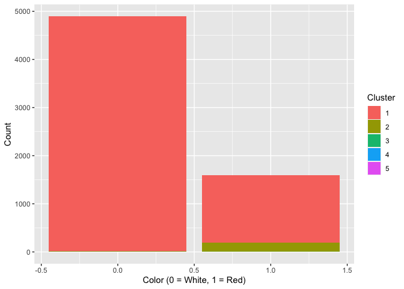

 

### Exercises 4

#### Abby Johnson

#### 5/2/22

 

### 1) Clustering & PCA

 

The *vinho verde* wine from northern Portugal is formulated from 11
different chemical properties. Using data from 6500 different bottles of
red and white wine and their individual chemical makeup and quality
rating, how can we methodologically distinguish the red from the white
wine and the low-quality from the high-quality wine?

 

#### **PCA**

First, let’s try Principal Component Analysis (PCA) to distinguish the
different bottles of wine among the data. When we group the data by the
color of wine, we can summarize the average amount of each chemical
property and average quality rating for each color of wine.

 

**Average amounts by color of wine**

<table>
<thead>
<tr class="header">
<th></th>
<th>Red</th>
<th>White</th>
</tr>
</thead>
<tbody>
<tr class="odd">
<td>Fixed Acidity</td>
<td>8.32</td>
<td>6.85</td>
</tr>
<tr class="even">
<td>Volatile Acidity</td>
<td>0.53</td>
<td>0.28</td>
</tr>
<tr class="odd">
<td>Citric Acid</td>
<td>0.27</td>
<td>0.33</td>
</tr>
<tr class="even">
<td>Residual Sugar</td>
<td>2.54</td>
<td>6.39</td>
</tr>
<tr class="odd">
<td>Chlorides</td>
<td>0.09</td>
<td>0.05</td>
</tr>
<tr class="even">
<td>Free Sulfur Dioxide</td>
<td>15.87</td>
<td>35.31</td>
</tr>
<tr class="odd">
<td>Total Sulfur Dioxide</td>
<td>46.47</td>
<td>138.36</td>
</tr>
<tr class="even">
<td>Density</td>
<td>1.00</td>
<td>0.99</td>
</tr>
<tr class="odd">
<td>pH</td>
<td>3.31</td>
<td>3.19</td>
</tr>
<tr class="even">
<td>Sulphates</td>
<td>0.66</td>
<td>0.49</td>
</tr>
<tr class="odd">
<td>Alcohol</td>
<td>10.42</td>
<td>10.51</td>
</tr>
<tr class="even">
<td>Quality</td>
<td>5.64</td>
<td>5.88</td>
</tr>
</tbody>
</table>

When we look at the correlation of components from this average summary,
we can visualize which groups of components are similar to each
other.

 

 We can clearly see a perfect correlation
between two groups of wine components. So, the chemical components
do seem to distinct groups.

When we run the PCA analysis, we get two distinct principal component
groups (as seen below).

 

**PCA Results**

<table>
<thead>
<tr class="header">
<th></th>
<th>PC1</th>
<th>PC2</th>
</tr>
</thead>
<tbody>
<tr class="odd">
<td>Fixed Acidity</td>
<td>0.29</td>
<td>-0.39</td>
</tr>
<tr class="even">
<td>Volatile Acidity</td>
<td>0.29</td>
<td>-0.08</td>
</tr>
<tr class="odd">
<td>Citric Acid</td>
<td>-0.29</td>
<td>-0.79</td>
</tr>
<tr class="even">
<td>Residual Sugar</td>
<td>-0.29</td>
<td>-0.04</td>
</tr>
<tr class="odd">
<td>Chlorides</td>
<td>0.29</td>
<td>0.04</td>
</tr>
<tr class="even">
<td>Free Sulfur Dioxide</td>
<td>-0.29</td>
<td>0.15</td>
</tr>
<tr class="odd">
<td>Total Sulfur Dioxide</td>
<td>-0.29</td>
<td>-0.12</td>
</tr>
<tr class="even">
<td>Density</td>
<td>0.29</td>
<td>0.04</td>
</tr>
<tr class="odd">
<td>pH</td>
<td>0.29</td>
<td>0.04</td>
</tr>
<tr class="even">
<td>Sulphates</td>
<td>0.29</td>
<td>-0.41</td>
</tr>
<tr class="odd">
<td>Alcohol</td>
<td>-0.29</td>
<td>0.08</td>
</tr>
<tr class="even">
<td>Quality</td>
<td>-0.29</td>
<td>-0.04</td>
</tr>
</tbody>
</table>

 

Applying the PCA results to the two different colors of wine, we get:

<table>
<thead>
<tr class="header">
<th></th>
<th>PC1</th>
<th>PC2</th>
</tr>
</thead>
<tbody>
<tr class="odd">
<td>White</td>
<td>-2.45</td>
<td>4.96e-16</td>
</tr>
<tr class="even">
<td>Red</td>
<td>2.45</td>
<td>7.29e-16</td>
</tr>
</tbody>
</table>

We can see that PC1 is positively associated with red wine, indicating
that PC1 likely differentiates on color of wine. Meanwhile, PC2 is
positively correlated with both colors of wine, but is slightly bigger
for red wine, indicating PC2 may differentiate on a combination of some
chemical properties or quality.

 

Now, we can use principal component regression to better analyze the
differentiating power of PCA.

First, we can regress wine quality onto PC1 and PC2, and get:

<table>
<caption>
Coefficient-Level Estimates for a Model Fitted to Estimate Variation in
Wine Quality.
</caption>
<thead>
<tr>
<th style="text-align:left;">
Predictor
</th>
<th style="text-align:right;">
B
</th>
<th style="text-align:right;">
SE
</th>
<th style="text-align:right;">
t
</th>
<th style="text-align:right;">
p
</th>
</tr>
</thead>
<tbody>
<tr>
<td style="text-align:left;">
(Intercept)
</td>
<td style="text-align:right;">
5.7569659
</td>
<td style="text-align:right;">
0.0124869
</td>
<td style="text-align:right;">
461.04166
</td>
<td style="text-align:right;">
0
</td>
</tr>
<tr>
<td style="text-align:left;">
PC1
</td>
<td style="text-align:right;">
-0.0493749
</td>
<td style="text-align:right;">
0.0050977
</td>
<td style="text-align:right;">
-9.68565
</td>
<td style="text-align:right;">
0
</td>
</tr>
<tr>
<td style="text-align:left;">
PC2
</td>
<td style="text-align:right;">
NA
</td>
<td style="text-align:right;">
NA
</td>
<td style="text-align:right;">
NA
</td>
<td style="text-align:right;">
NA
</td>
</tr>
</tbody>
</table>

PC2 is dropped from the model due to multiocollinearity in the model.
This is to be expected considering the chemical properties were
perfectly correlated with each other. This regression analysis tells us
that a positive association with PC1 is predicted to decrease quality,
on average, by about 0.049 units at a statistically significant level. Red wine is more positively associated
with PC1 and has a slightly lower average quality than white wine, so
these regression results makes sense.

 

Then, we can regress wine color onto PC1 and PC2, and get:

<table>
<caption>
Coefficient-Level Estimates for a Model Fitted to Estimate Variation in
Wine Color
</caption>
<thead>
<tr>
<th style="text-align:left;">
Predictor
</th>
<th style="text-align:right;">
B
</th>
<th style="text-align:right;">
SE
</th>
<th style="text-align:right;">
t
</th>
<th style="text-align:right;">
p
</th>
</tr>
</thead>
<tbody>
<tr>
<td style="text-align:left;">
(Intercept)
</td>
<td style="text-align:right;">
0.5000000
</td>
<td style="text-align:right;">
0
</td>
<td style="text-align:right;">
1.254197e+15
</td>
<td style="text-align:right;">
0
</td>
</tr>
<tr>
<td style="text-align:left;">
PC1
</td>
<td style="text-align:right;">
0.2041241
</td>
<td style="text-align:right;">
0
</td>
<td style="text-align:right;">
1.254197e+15
</td>
<td style="text-align:right;">
0
</td>
</tr>
<tr>
<td style="text-align:left;">
PC2
</td>
<td style="text-align:right;">
NA
</td>
<td style="text-align:right;">
NA
</td>
<td style="text-align:right;">
NA
</td>
<td style="text-align:right;">
NA
</td>
</tr>
</tbody>
</table>

This tells us that a positive association with PC1 is predicted to
increase the probability a bottle of wine is red by about 20%. Once
again, this is consistent with our previous analysis of the principal
components for each color of wine.

 

Based on the principal component regression analysis, this
dimensionality reduction technique appears to be successful in
differentiating color and quality of wine.

 

#### **Clustering**

Next, let’s analyze the performance of hierarchical clustering in
differentiating wine color and quality. Using the best performing
hierarchical clustering method, we can summarize how the data is
clustered into five different groups:

    ##    1    2    3    4    5 
    ## 6287  206    2    1    1

The data is clearly clustered mostly into group 1, with some smaller
numbers as we get to group 5. Now that the data is grouped, we can
analyze how the clustering method differentiated the data into each
cluster.

Specifically, we can analyze if clusters clearly distinguish between
color and/or quality of the wine.

 

 We can clearly see that no cluster
clearly identifies a certain group of wine quality.

 

 Once again, no cluster clearly
identifies a certain color of wine. So, this provides evidence to
clustering’s ineffectiveness in differentiating the wine by color and
quality.

 

### 2) Market Segmentation

 

#### **Overview**

Understanding the target audience of a product is crucial to developing
successful online-advertising campaigns. Such is the case for
NutrientH20, a large consumer drinks brand. How can we identify and
better reach the biggest NutrientH20 customer groups?

 

#### **Data & Model**

In order understand the online-advertising customer base, NutrientH20’s
advertising team took a sample of the brand’s Twitter followers and
collected each user’s posts(“tweets”) over a seven day period in June
2014. Then, every post was examined by a human annotator contracted
through Amazon’s Mechanical Turk service. Each tweet was categorized
based on its content using a pre-specified scheme of 36 different
categories, each representing a broad area of interest (e.g. politics,
sports, family, etc.).

Three of the 36 different tweet categories indicate a certain form of
uninformative content: chatter, spam, and adult(adult content). In order
to mitigate the bias of these uninformative categories, I only kept
users with zero spam or adult content and only average levels of
chatter. After filtering and cleaning, the data contains information on
about 5,000 NutrientH20 Twitter followers.

To differentiate each user into an identifiable customer group based on
their Twitter content, I used hierarchical clustering. This unsupervised
learning technique automatically groups users into different clusters
based on similarities in user content. Then, each cluster can be
analyzed to identify each NutrientH20 customer group.

 

#### **Results**

First, we let's understand how many users are in each cluster:

    ##    1    2    3    4 
    ## 4347  499   40   67

We can clearly see that Cluster 1 is the biggest customer group.

Now, we can inspect the average amounts of the top content categories
for each cluster.

 Cluster 1, the largest customer group,
posts content mostly related to health/nutrition and general chatter.

 Cluster 2, the second largest customer
group, is mostly interested in content related to sports(fandom for a
sport/team) and religion.

 Cluster 4, the third largest customer
group, is mostly interested in content related to cooking and fashion.

 Meanwhile, Cluster 3, the smallest
customer group, is mostly interested in politics and travel.

 

#### **Conclusion**

Based on the category analysis for each cluster, we can identify
NutrientH20’s biggest customer group and their primary interests. The
two largest customer group make up about 98% of the total customer
sample, so NutrientH20 should really hone in on the few key interests of
the two largest clusters.

The largest NutrientH20 audience is users focused on their health
and nutrition and who are likely active on social media (a large
interest in chatter). The next biggest NutrientH20 audience is users
interested in sports and religion. So, with a focus on health/nutrition,
social media engagement, sports, and religious ideals, NutrientH20 can
better reach its customer base through online-marketing messages.

 

### 3) Association rules for grocery purchases

 

#### **Overview**

Can we define association rules for grocery shopping? How does picking
on item affect the probability of putting another item in your shopping
cart? We can define association rules for these relationships to
understand how certain buying behavior increases the probability of
future behavior.

 

#### **Data & Model**

We have data on about 9,800 different grocery shoppers and every
purchased item from their grocery basket.

In order create associative relationship between the items in a shoppers
cart, I use an association rules model to define the support,
confidence, and lift between two product purchases. From these
relationships, we can better understand what products are most
frequently purchased, and the probability of what other products will be
purchased in addition.

 

#### **Results**

Looking at a two-key plot of the grocery baskets for each shopper, we
can understand the spread of support, confidence, and lift:

 Looking at the plot, we can see that most
support is starts at about 0.02 and increases from there, and the
confidence starts at around 0.1 and increases. These levels of
confidence and support will serve as parameter thresholds for the
association rules.

Using these parameter thresholds, we can define association rules across
different grocery items, and ultimately build a network of
relationships:  From the network, we can
see that whole milk, other vegetables, and rolls/buns are the most
popular and integral items in the association network. The association
rules with the highest lift, are items in relation to these three
products. For example, the association of a shopper that bought butter
then buying whole milk has a lift of about 2-2.25.

 

#### **Conclusion**

From the network of association rules, we can better understand grocery
shopping behavior and how it affects future purchases. The most popular
and central items are whole milk, vegetables, and rolls/buns. It makes
sense that these products are so integral to the grocery shopping rules,
because they are all perishable and frequently consumed items. So, we
would expect these items to be on most shoppers’ weekly shopping list.
Therefore, when shoppers buy these perishable goods, it increases the
probability that they are also going to purchase more perishable produce
or bread such as butter, fruit, or pastries.

 
